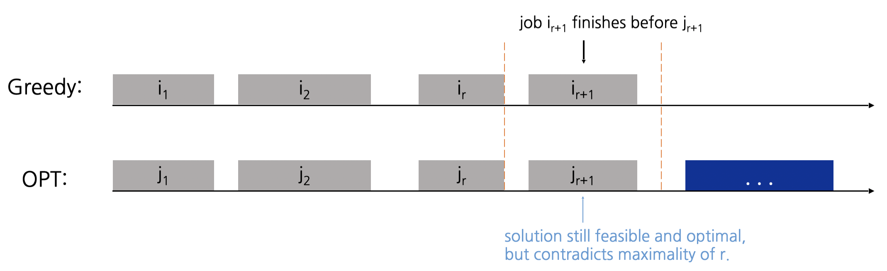

# 03. 그리디

> [!NOTE]
> 현재 상황에서 가장 좋아 보이는 것만을 선택

## 이론
- 그리디 알고리즘은 **현재 상황에서 가장 좋아보이는** 선택지를 고르며, 추후의 영향은 고려하지 않는다.
- 문제에서 *'가장 큰 순서대로'* 혹은 *'가장 작은 순서대로'* 같은 기준을 제시하는 경우가 많다.
    - 따라서 주로 정렬 알고리즘과 짝을 이뤄 출제된다.
- 그리디가 항상 최적의 해를 도출하는 것은 아니기 때문에 반드시 **정당성을 검토**할 수 있어야 한다.

## 서브 토픽
### Interval Scheduling

> 태스크들의 수행 시간이 겹치지 않도록하면서 최대한 많은 태스크를 수행할 수 있도록 선택하는 문제.

각 태스크의 시작하는 시점과 끝나는 시점이 주어졌을 때, 수행 시간이 겹치지 않으면서 태스크를 최대한 많이 수행할 수 있는 조합을 선택한다고 하자.

**1. Earliest Start Time**

시작하는 시점이 가장 빠른 태스크를 선택한다고 하자. 이 때 선택된 태스크의 수행 시간이 매우 길다면 최적의 선택지가 아니게 된다.

**2. Shortest Interval**

그렇다고 해서 수행 시간이 가장 짧은 태스크는 위와 같은 사례로 인해 역시 최적의 선택지가 아니다.

**3. Fewest Conflicts**

수행 시간이 겹치는 태스크의 갯수가 최소인 것을 선택해도 마찬가지로 최적의 선택지가 아니다.

**4. Earliest Finish Time**

따라서 끝나는 시점이 가장 빠른 태스크를 그리디하게 선택하는 것이 최적의 선택지일 것이다.

> [!TIP]
> 귀류법으로 증명해보자.
> 
> 1. 그리디로 선택된 태스크들이 i1, i2, ..., im이라고 하자.
> 2. 최적의 해로 선택된 태스크들이 j1, j2, ..., jn이라고 하자.
> 3. (가정) 이 때 처음으로 ik != jk가 되도록 하는 지점을 r+1이라고 하자. 즉, 그리디로 선택된 조합은 k = r까지는 최적의 조합이지만 k = r+1부터는 최적의 조합이 아닌 것이다.
> 4. 하지만 우리는 r+1번째 태스크를 선택할 때 끝나는 시점이 가장 빠른 태스크를 선택했으므로, ir+1의 끝나는 시점은 jr+1보다 빠를 것이다.
> 5. 따라서 그리디로 선택된 조합은 r+1에서도 여전히 최적의 조합이므로 가정에 위반된다.
>
> 

**연관 문제**
- 백준 1931번

