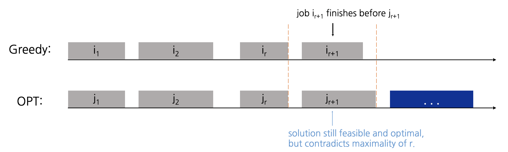

# 03. 그리디

> [!NOTE]
> 현재 상황에서 가장 좋아 보이는 것만을 선택

## 이론
- 그리디 알고리즘은 **현재 상황에서 가장 좋아보이는** 선택지를 고르며, 추후의 영향은 고려하지 않는다.
- 문제에서 *'가장 큰 순서대로'* 혹은 *'가장 작은 순서대로'* 같은 기준을 제시하는 경우가 많다.
    - 따라서 주로 정렬 알고리즘과 짝을 이뤄 출제된다.
- 그리디가 항상 최적의 해를 도출하는 것은 아니기 때문에 반드시 **정당성을 검토**할 수 있어야 한다.

## 서브 토픽
### Interval Scheduling

> 태스크들의 수행 시간이 겹치지 않도록, 최대한 많은 태스크를 수행할 수 있도록 선택하는 문제.

각 태스크의 시작하는 시점과 끝나는 시점이 주어졌을 때, 수행 시간이 겹치지 않으면서 태스크를 최대한 많이 수행할 수 있는 조합을 선택한다고 하자.

|기준|반례|설명|
|-|-|-|
|1. Earliest Start Time||선택된 태스크의 수행 시간이 매우 길다면 최적의 선택지가 아닐 수 있다.|
|2. Shortest Interval||시간이 짧아도 충돌(conflict)로 인해 최적의 선택지가 아닐 수 있다.|
|3. Fewest Conflicts||그래서 충돌 횟수가 최소인 태스크를 선택해도 최적의 선택지가 아닐 수 있다.|

**4. Earliest Finish Time**: 따라서 끝나는 시점이 가장 빠른 태스크를 그리디하게 선택하는 것이 최적의 해(Optimal solution)일 것이다.

> [!TIP]
> 귀류법으로 증명해보자.
> 
> 1. 그리디로 선택된 태스크들이 i<sub>1</sub>, i<sub>2</sub>, ..., i<sub>m</sub>이라고 하자.
> 2. 최적의 해로 선택된 태스크들이 j<sub>1</sub>, j<sub>2</sub>, ..., j<sub>n</sub>이라고 하자.
> 3. (가정) 이 때 처음으로 i<sub>k</sub> != j<sub>k</sub>가 되도록 하는 지점을 r+1이라고 하자. 즉, 그리디로 선택된 조합은 k = r까지는 최적의 조합이지만 k = r+1부터는 최적의 조합이 아닌 것이다.
> 4. 하지만 우리는 r+1번째 태스크를 선택할 때 끝나는 시점이 가장 빠른 태스크를 선택했으므로, i<sub>r+1</sub>의 끝나는 시점은 j<sub>r+1</sub>보다 빠를 것이다.
> 5. 따라서 그리디로 선택된 조합은 r+1에서도 여전히 최적의 조합이므로 가정에 위배된다.
>
> 

**연관 문제**
- 백준 1931번

### Interval Partitioning

> 동시에 진행되는 수업들은 서로 다른 강의실에서 진행되도록, 모든 수업들을 최소한의 강의실을 사용하여 배정하는 문제.

Interval scheduling이 *"한 강의실에 최대한 많은 수업을 배정하는"* 문제였다면 interval partitioning은 *"최대한 적은 수의 강의실에 모든 수업을 배정하는"* 문제이다.


한 시점에 동시에 진행되는 수업의 최대 개수를 **depth**라고 하면, (필요한 강의실의 개수) ≥ (depth)임을 관찰할 수 있다. 이 때 이 조건의 lower bound를 만족하는, 다시 말해 (사용할 강의실의 개수) = (depth)가 되도록 하는 조합을 찾을 수 있을까? 

수업 j를 시작하는 시간 s<sub>j</sub>에 따라 정렬한 후 아래와 같은 방식으로 배정해보자.

```
d = 0
for j = 1 to n:
    if (lecture j is compatible with classroom k):
        schedule lecture j in classroom k
    else:
        allocate a new classroom (d + 1)
        schedule lecture j in classroom (d + 1)
        d += 1
```

즉 기존의 d개의 강의실 중 한 곳에 j번째 수업을 배정할 수 있다면 배정하고, 만약 d개의 강의실이 모두 사용중이면 새로운 (d + 1)번째 강의실에 j번째 수업을 배정하는 것이다. 위 과정을 거치면 (총 사용한 강의실의 개수) = (depth)가 되어 최적의 해를 도출할 수 있게 된다.


- (d + 1)번째 강의실을 사용하는 이유는 s<sub>j</sub>에 d개의 수업이 동시에 진행중이기 때문이다.
- 따라서 s<sub>j</sub> + ε에는 j번째 수업까지 총 (d + 1)개의 수업이 진행중일 것이다(=depth가 d+1).
- (총 사용한 강의실의 개수) = (depth) = (d + 1)이므로 최적의 해임을 알 수 있다.

> [!TIP]
> 수업 종료시간에 대한 최소-힙(Min-heap)을 사용하면 배정할 강의실을 O(log n)에 찾을 수 있다.

**연관 문제**
- 백준 11000번