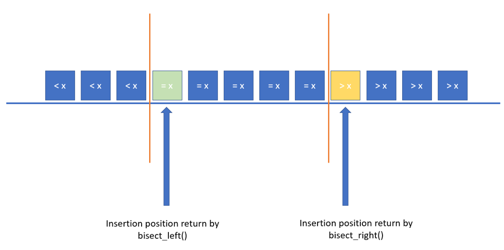

# 07. 이진 탐색

> [!NOTE]
> 탐색 범위를 반으로 좁혀가며 빠르게 탐색하는 알고리즘

## 이론
### 이진 탐색 (Binary Search)
- **순차 탐색**(Linear Search)은 특정 데이터를 찾기 위해 배열의 맨 앞부터 순차적으로 탐색한다.
    - 따라서 연산 횟수는 $O(N)$이다.
- **이진 탐색**은 *정렬된* 데이터 안에서 탐색 범위를 절반씩 좁혀가면서 특정 데이터를 찾는다.
    - 탐색 범위의 길이가 1이 될 때 탐색을 종료한다. 
        - 부분 문제(sub-problem)가 한 개인 분할-정복 문제(Decrease-and-conquer)에 속한다.
        - 탐색 종료 위치의 데이터가 찾고자 했던 데이터와 다르면 그 데이터는 존재하지 않는 것이다.
    - 정렬된 데이터에서 연산 횟수는 $O(\log N)$이다.

### 이진 탐색 트리 (Binary Search Tree)
- 트리의 노드 $x$는 항상 두 개의 자식 노드 $x_L$, $x_R$을 갖는다.
    - 모든 $x$에 대해 $x_L \lt x \lt x_R$이 성립한다.

## 파이썬 표준 라이브러리
### [`bisect` — Array bisection algorithm](https://docs.python.org/3/library/bisect.html#module-bisect)
- 호출하기 전에 미리 정렬해놔야 한다.
- *정렬된* 리스트에 $x$를 삽입하려고 할 때, $x$가 삽입되어야 할 위치(인덱스)를 반환해준다.
    <!-- - $x$가 삽입될 위치를 기준으로 리스트 왼쪽을 $L$, 오른쪽을 $R$이라고 하면
    - `bisect_left()`: $L = \lbrace i \in A: i \lt x \rbrace$, $R = \lbrace i \in A: i \geq x \rbrace$
    - `bisect()` / `bisect_right()`: $L = \lbrace i \in A: i \leq x \rbrace$, $R = \lbrace i \in A: i \gt x \rbrace$ -->
- 정렬 메서드와 유사하게 `key` 인자를 통해 비교 키를 지정할 수 있다.

### Lower Bound & Upper Bound
- `bisect.bisect_left()`와 `bisect.bisect_right()`는 각각 인자로 주어진 값의 하한(lower bound)과 상한(upper bound)를 반환한다.

- 오름차순으로 정렬된 리스트 $A$에 데이터 $x$를 삽입했을 때, $x$를 기준으로 왼쪽을 $L$, 오른쪽을 $R$이라고 하면
    - 하한에 삽입: $L = \lbrace i \in A: i \lt x \rbrace$, $R = \lbrace i \in A: i \geq x \rbrace$
    - 상한에 삽입: $L = \lbrace i \in A: i \leq x \rbrace$, $R = \lbrace i \in A: i \gt x \rbrace$
- 주어진 값이 리스트 안에 존재하지 않으면 동일한 값을 반환할 것이다.

<div align="center">
    
</div>

**소스코드: [Lib/bisect.py](https://github.com/python/cpython/tree/3.12/Lib/bisect.py)**
```python
def bisect_left(a, x, lo=0, hi=None, *, key=None):
    # (전략)
    if key is None:
        while lo < hi:
            mid = (lo + hi) // 2
            if a[mid] < x:
                lo = mid + 1
            else:
                # 중간값과 탐색하려는 값이 같다면 
                # 탐색 범위의 끝 지점을 조정
                # (Next interval: lower half)
                hi = mid
    # (후략)
    return lo

def bisect_right(a, x, lo=0, hi=None, *, key=None):
    # (전략)
    if key is None:
        while lo < hi:
            mid = (lo + hi) // 2
            if x < a[mid]:
                hi = mid
            else:
                # 중간값과 탐색하려는 값이 같다면 
                # 탐색 범위의 시작 지점을 조정
                # (Next interval: upper half)
                lo = mid + 1
    # (후략)
    return lo
```

## 서브 토픽
### 파라메트릭 서치 (Parametric Search)
- 최적화 문제를 결정 문제(i.e. Yes-no question)로 바꾸어 해결하는 기법이다.
    - *주어진 값(threshold)보다 나은 해가 존재하는가?* 에 대한 결정 문제로 바뀐다.
- 이진 탐색을 활용하여 해의 범위를 좁혀나가는 방식이다.
    - 특정 조건을 만족시키는 최댓값을 구하는 문제
        - 최댓값의 위치: `bisect_right() - 1`
        - `bisect_right()`는 주어진 기준을 *초과*하는 첫 번째 위치를 반환하므로 1을 빼준 위치가 기준을 만족시키는 상한값의 위치이다.
    - 특정 조건을 만족시키는 최솟값을 구하는 문제
        - 최솟값의 위치: `bisect_left()`